 Prepare the general libraries.


```R
# libraries
library(community)
library(ggplot2)
```

 Prepare the path.


```R
# the path to the counts, cell annotation and sample annation file. In this case its our working dir same as
# the notebook
path_in <- 'computed_results/'

print("path_in")
print(path_in)
```

    [1] "path_in"
    [1] "computed_results/"


Load data.


```R
suppressWarnings(load(paste0(path_in,"/interactions.RData")))
```

Load functions for visualization.


```R
data("visualization_functions")
```


```R
DEG_Lasry <- read.csv(paste0(path_in,"DEG_significant_table_Lasry.csv")
                                   ,check.names=FALSE
                                   ,row.names = 1)

print(str(DEG_Lasry))
```

    'data.frame':	1358 obs. of  7 variables:
     $ cluster   : chr  "Mono" "Mono" "Mono" "Mono" ...
     $ gene      : chr  "ISG15" "RBP7" "C1QA" "CD52" ...
     $ p_val     : num  0 0 0 0 0 0 0 0 0 0 ...
     $ avg_log2FC: num  0.692 -0.43 0.369 -0.617 0.674 ...
     $ pct.1     : num  0.739 0.113 0.36 0.295 0.742 0.489 0.55 0.643 0.412 0.383 ...
     $ pct.2     : num  0.243 0.473 0.043 0.791 0.224 0.133 0.188 0.061 0.076 0.085 ...
     $ p_val_adj : num  0 0 0 0 0 0 0 0 0 0 ...
    NULL


## Parameters


```R
# threshold for log2FC of the weights
threshold_log2FC <- interactions$thresholds$threshold_log2FC

idx_up <- interactions$anno_interactions$log2FC_weights > threshold_log2FC
idx_unchanged <- abs(interactions$anno_interactions$log2FC_weights)<= threshold_log2FC
idx_down <- interactions$anno_interactions$log2FC_weights < -threshold_log2FC
idx_sign <- !is.na(interactions$anno_interactions$sign) & interactions$anno_interactions$sign
idx_good <- interactions$anno_interactions$passed_QC_filter
```


```R
# extract cell types
cell_types <- unique(interactions$anno_cells$cell_type)
print(cell_types)
```

    [1] "Mono" "Gran" "T"    "NK"   "B"    "HSPC" "Ery"  "DC"  


```R
# define broad type of interactions by cell types
immune_cell_types <- cell_types[!(cell_types %in% c("Ery","HSPC"))]

interaction_cell_types <- unique(paste(interactions$anno_interactions$sending_cell_type
                                ,interactions$anno_interactions$receiving_cell_type
                                ,sep = " to "))

interaction_type <- sapply(interaction_cell_types
                           ,function(i){
                               ifelse(grepl("Ery",i)
                                      ,"engages Ery"
                                      ,ifelse(grepl("HSPC",i)
                                              ,"engages HSPC"
                                              ,"among immune cells"))
                           })
print(str(interaction_type))

interaction_type_by_ID <- sapply(interactions$anno_interactions$interaction_ID
                           ,function(i){
                               ifelse(grepl("Ery",i)
                                      ,"engages Ery"
                                      ,ifelse(grepl("HSPC",i)
                                              ,"engages HSPC"
                                              ,"among immune cells"))
                           })
print(str(interaction_type_by_ID))

colors_interaction_type <- c("engages HSPC" = "magenta"
                             ,"among immune cells" = "deepskyblue"
                             ,"engages Ery" = "lightgoldenrod"
                            )
print(colors_interaction_type)
```

     Named chr [1:64] "among immune cells" "among immune cells" ...
     - attr(*, "names")= chr [1:64] "Mono to Mono" "Mono to Gran" "Mono to T" "Mono to NK" ...
    NULL
     Named chr [1:151744] "among immune cells" "among immune cells" ...
     - attr(*, "names")= chr [1:151744] "Mono:A2M_Mono:LRP1" "Mono:ACTR2_Mono:ADRB2" "Mono:ACTR2_Mono:LDLR" "Mono:ADM_Mono:ACKR3" ...
    NULL
          engages HSPC among immune cells        engages Ery 
             "magenta"      "deepskyblue"   "lightgoldenrod" 


## Visualization: all good quality interactions

### Mean weight vs mean number 


```R
library(ggrepel) # to add text labels on the mean weigth vs number of interactions plot
```


```R
# claclulate mean weight of good interactions for each cell type to cell type communication (i.e. "T to B", "DC to T")
mean_weights_goodInteractions <- mean_weights(interactions)

print(str(mean_weights_goodInteractions))
```

    List of 2
     $ AML    :'data.frame':	8 obs. of  8 variables:
      ..$ Mono: num [1:8] 0.06908 0.05932 0.0184 0.01397 0.00936 ...
      ..$ Gran: num [1:8] 0.0613 0.0717 0.0199 0.0124 0.0239 ...
      ..$ T   : num [1:8] 0.0185 0.0228 0.1493 0.1073 0.0357 ...
      ..$ NK  : num [1:8] 0.0135 0.014 0.102 0.0859 0.021 ...
      ..$ B   : num [1:8] 0.00861 0.02227 0.03556 0.02117 0.02579 ...
      ..$ HSPC: num [1:8] 0.0152 0.0333 0.0389 0.0244 0.0321 ...
      ..$ Ery : num [1:8] 0.00135 0.00713 0.00998 0.00336 0.00972 ...
      ..$ DC  : num [1:8] 0.01863 0.02466 0.04077 0.03062 0.00932 ...
     $ healthy:'data.frame':	8 obs. of  8 variables:
      ..$ Mono: num [1:8] 0.0495 0.068 0.0401 0.0319 0.0389 ...
      ..$ Gran: num [1:8] 0.0677 0.1046 0.0552 0.0372 0.0587 ...
      ..$ T   : num [1:8] 0.0436 0.0584 0.0657 0.0363 0.0535 ...
      ..$ NK  : num [1:8] 0.0315 0.0375 0.0347 0.0253 0.0263 ...
      ..$ B   : num [1:8] 0.0416 0.0625 0.0519 0.0285 0.0798 ...
      ..$ HSPC: num [1:8] 0.01025 0.01494 0.00851 0.00629 0.00883 ...
      ..$ Ery : num [1:8] 0.00766 0.00974 0.00503 0.00471 0.00684 ...
      ..$ DC  : num [1:8] 0.0709 0.0894 0.0524 0.0425 0.0525 ...
    NULL


```R
# claclulate number of good interactions for each cell type to cell type communication (i.e. "T to B", "DC to T")
number_goodInteractions <- number_interactions(interactions)

print(str(number_goodInteractions))
```

    List of 2
     $ AML    :'data.frame':	8 obs. of  8 variables:
      ..$ Mono: int [1:8] 277 262 140 146 147 228 132 241
      ..$ Gran: int [1:8] 257 259 135 149 139 220 162 245
      ..$ T   : int [1:8] 142 134 90 98 91 131 91 129
      ..$ NK  : int [1:8] 116 113 70 77 65 107 59 112
      ..$ B   : int [1:8] 117 116 68 66 73 107 60 108
      ..$ HSPC: int [1:8] 206 204 121 124 115 187 127 201
      ..$ Ery : int [1:8] 137 166 92 81 94 160 121 116
      ..$ DC  : int [1:8] 207 211 109 123 116 184 96 206
     $ healthy:'data.frame':	8 obs. of  8 variables:
      ..$ Mono: int [1:8] 276 263 139 146 147 236 144 245
      ..$ Gran: int [1:8] 258 262 136 150 140 234 182 252
      ..$ T   : int [1:8] 142 135 90 98 91 132 95 132
      ..$ NK  : int [1:8] 117 115 70 77 65 108 59 116
      ..$ B   : int [1:8] 116 116 67 65 72 106 69 111
      ..$ HSPC: int [1:8] 218 219 126 128 119 189 127 211
      ..$ Ery : int [1:8] 145 186 98 90 100 160 121 161
      ..$ DC  : int [1:8] 222 233 116 130 122 210 141 223
    NULL


```R
immune_cell_types <- cell_types[!(cell_types %in% c("Ery","HSPC"))]
grepl(paste(immune_cell_types, collapse="|"), "B cell")
```


TRUE


```R
# plot mumber of interactions vs mean interaction weights per cell type to cell type interaction
options(repr.plot.width = 10
        ,repr.plot.height = 10)

ylim <- c(-3.65, -0.9)
xlim <- c(-20, 700)

plot_nrInt_vs_meanW_perCellType(interactions
                               ,interaction_type = interaction_type
                               ,colors = colors_interaction_type
                               ,ylim = ylim
                               ,label_font_size = 10)
```

    'data.frame':	64 obs. of  4 variables:
     $ mean_interaction_weight: num  0.06908 0.05932 0.0184 0.01397 0.00936 ...
     $ number_of_interactions : int  277 262 140 146 147 228 132 241 257 259 ...
     $ interaction_ID         : chr  "Mono to Mono" "Gran to Mono" "T to Mono" "NK to Mono" ...
     $ interaction_type       : chr  "among immune cells" "among immune cells" "among immune cells" "among immune cells" ...
    NULL
    'data.frame':	64 obs. of  4 variables:
     $ mean_interaction_weight: num  0.0495 0.068 0.0401 0.0319 0.0389 ...
     $ number_of_interactions : int  276 263 139 146 147 236 144 245 258 262 ...
     $ interaction_ID         : chr  "Mono to Mono" "Gran to Mono" "T to Mono" "NK to Mono" ...
     $ interaction_type       : chr  "among immune cells" "among immune cells" "among immune cells" "among immune cells" ...
    NULL


    Warning message:
    “Removed 1 rows containing non-finite values (`stat_ellipse()`).”
    Warning message:
    “Removed 1 rows containing missing values (`geom_point()`).”
    Warning message:
    “Removed 1 rows containing missing values (`geom_text_repel()`).”
    Warning message:
    “ggrepel: 55 unlabeled data points (too many overlaps). Consider increasing max.overlaps”
    Warning message:
    “ggrepel: 60 unlabeled data points (too many overlaps). Consider increasing max.overlaps”


    [[1]]
    
    [[2]]


    
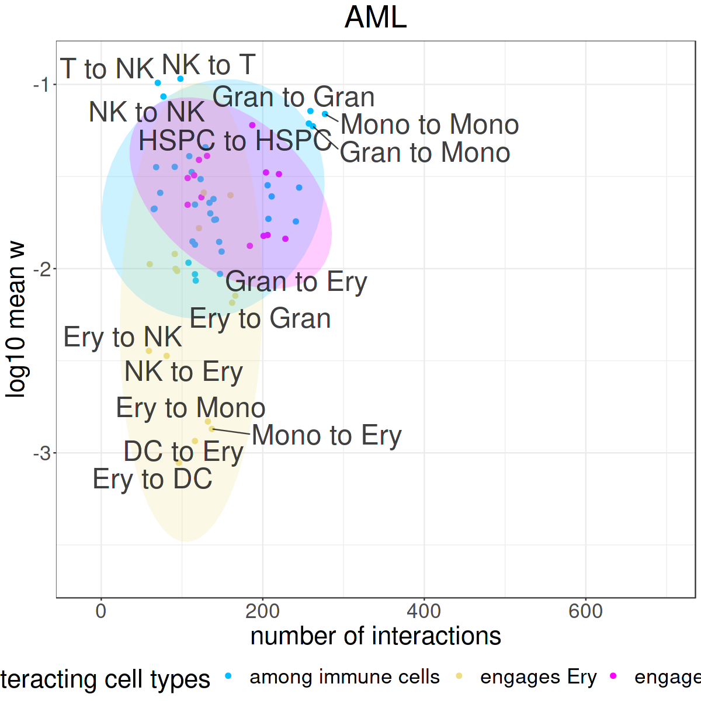
    


    
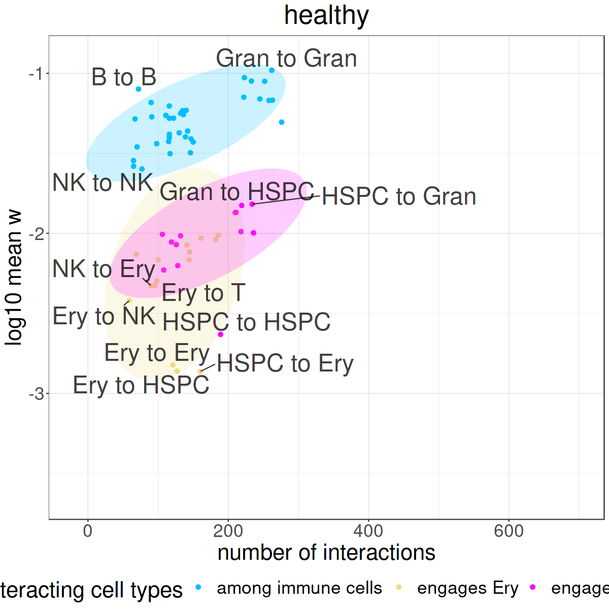
    


### Ligand-receptor families

## Visualization of differential interactions

### Voclano


```R
print("downregulated:")
print(sum(idx_down & idx_sign))

print("upregulated:")
print(sum(idx_up & idx_sign))
```

    [1] "downregulated:"
    [1] 858
    [1] "upregulated:"
    [1] 14


```R
# REMOVE THIS AFTER RECOMPILING THE PACKAGE!!!

# recalculate log2FC of w
interactions$anno_interactions$log2FC_weights <- log2FC(x = interactions$weights,anno_samples = interactions$anno_samples)
```


```R
# volcano plot
options(repr.plot.height = 5
       ,repr.plot.width = 5)
    
plot_vulcano(interactions)
```


    
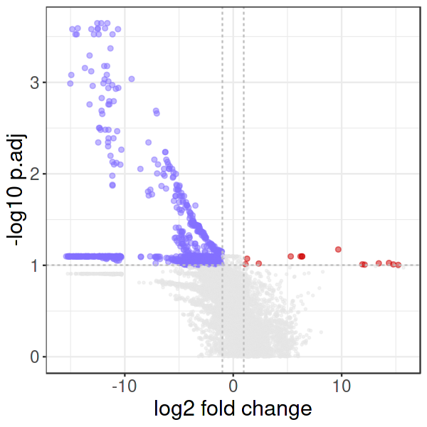
    


### Heatmap top differential


```R
library(ComplexHeatmap) # to plot heatmaps
library(circlize) # for gragient colors
```

    Loading required package: grid
    
    ========================================
    ComplexHeatmap version 2.10.0
    Bioconductor page: http://bioconductor.org/packages/ComplexHeatmap/
    Github page: https://github.com/jokergoo/ComplexHeatmap
    Documentation: http://jokergoo.github.io/ComplexHeatmap-reference
    
    If you use it in published research, please cite:
    Gu, Z. Complex heatmaps reveal patterns and correlations in multidimensional 
      genomic data. Bioinformatics 2016.
    
    The new InteractiveComplexHeatmap package can directly export static 
    complex heatmaps into an interactive Shiny app with zero effort. Have a try!
    
    This message can be suppressed by:
      suppressPackageStartupMessages(library(ComplexHeatmap))
    ========================================
    
    
    ========================================
    circlize version 0.4.15
    CRAN page: https://cran.r-project.org/package=circlize
    Github page: https://github.com/jokergoo/circlize
    Documentation: https://jokergoo.github.io/circlize_book/book/
    
    If you use it in published research, please cite:
    Gu, Z. circlize implements and enhances circular visualization
      in R. Bioinformatics 2014.
    
    This message can be suppressed by:
      suppressPackageStartupMessages(library(circlize))
    ========================================
    
    


```R
# heatmap of interactions weight of top differential interactions
# top adjusted p value
idx_topsign <- interactions$anno_interactions$p.adj %in% unique(sort(interactions$anno_interactions$p.adj))[1:300]
idx_topdown <- interactions$anno_interactions$log2FC_weights < -1 & idx_topsign
idx_topdown20 <- interactions$anno_interactions$interaction_ID %in% interactions$anno_interactions$interaction_ID[idx_topdown][1:8]

# all upregulated interactions
idx_topsign <- interactions$anno_interactions$p.adj %in% unique(sort(interactions$anno_interactions$p.adj))[1:500]
idx_topup <- interactions$anno_interactions$log2FC_weights > 1 & idx_topsign
idx_topup5 <- interactions$anno_interactions$interaction_ID %in% interactions$anno_interactions$interaction_ID[idx_topup][1:7]

# top 20 downregulated interactions

idx <- idx_topup5 | idx_topdown20
print(sum(idx))
```

    [1] 15


```R
set.seed(3)
options(repr.plot.height = 6
       ,repr.plot.width = 8.5
       )
plot_heatmap(interactions
            ,which_interactions = idx
            ,values_to_plot = "weights"
            ,row_font_size = 16
            ,column_font_size = 16
            )
```


    
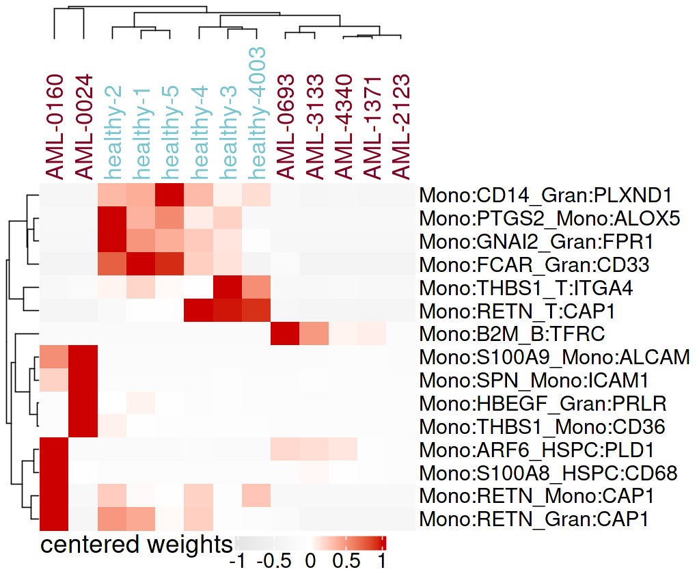
    


```R
# centred Heatmap
set.seed(3)
options(repr.plot.height = 7
       ,repr.plot.width = 8.5
       )
plot_heatmap(interactions
            ,which_interactions = idx
            ,values_to_plot = "weights"
            ,row_font_size =18
            ,column_font_size = 20
             ,centered = TRUE
             ,color_values = circlize::colorRamp2(c(-1,0,1), c("gray90","white", "red3"))
             ,legend_title_font_size = 22
             ,labels_font_size = 18
            )
```


    

    


### Barplot with cell type of differential interactions


```R
# stacked bar interaction classes: up- and downregulated
options(repr.plot.width = 3.5
       ,repr.plot.height = 6)

plot_stacked_bar(interactions
                ,idx_up = idx_up
                ,idx_down = idx_down
                ,idx_sign = idx_sign
                ,interaction_type = interaction_type_by_ID
                ,colors = colors_interaction_type
                ,font_size = 24
                )+
theme(legend.text = element_text(size=16)
      ,legend.title = element_text(size=16)
     ,legend.position = "bottom"
     ,legend.direction = "vertical")
```


    

    


### Network plots


```R
library(igraph) # to plot circus plots
```

    
    Attaching package: ‘igraph’
    
    
    The following object is masked from ‘package:circlize’:
    
        degree
    
    
    The following objects are masked from ‘package:stats’:
    
        decompose, spectrum
    
    
    The following object is masked from ‘package:base’:
    
        union
    
    


```R
options(repr.plot.width = 7
       ,repr.plot.height = 7)

colors <- colors_interaction_type[interaction_type]
names(colors) <- names(interaction_type)

plor_celltype_network(interactions
                     ,edge.color = colors
                     ,title_cex = 2.5
                     ,vertex.label.cex = 3
                     ,edge.arrow.size = 0.2
                     ,verbose = FALSE
                     )
```


    
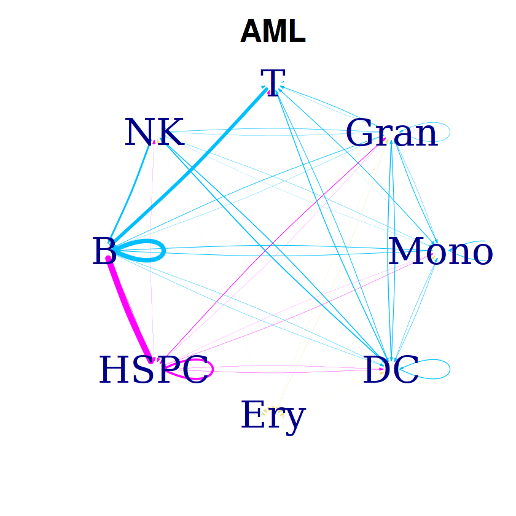
    


    

    


### Ligand-receptor families

## Visualization of individual components


### Forest plots


```R
library(gridExtra) 
```


```R
# indices

idx_sign <- !is.na(interactions$anno_interactions$sign) & interactions$anno_interactions$sign
idx_good <- interactions$anno_interactions$passed_QC_filter

idx_up <- interactions$anno_interactions$log2FC_weights >1
idx_unchanged <- abs(interactions$anno_interactions$log2FC_weights)<=1
idx_down <- interactions$anno_interactions$log2FC_weights < -1

idx_only_rho_s <- interactions$anno_interactions$components_affected_s == "rho" & interactions$anno_interactions$nr_comp_affected_b == 1 
idx_only_rho_r <- interactions$anno_interactions$components_affected_r == "rho" & interactions$anno_interactions$nr_comp_affected_b == 1 
idx_only_phi_s <- interactions$anno_interactions$components_affected_s == "phi" & interactions$anno_interactions$nr_comp_affected_b == 1 
idx_only_phi_r <- interactions$anno_interactions$components_affected_r == "phi" & interactions$anno_interactions$nr_comp_affected_b == 1 
idx_only_p_s <- interactions$anno_interactions$components_affected_s == "p" & interactions$anno_interactions$nr_comp_affected_b == 1 
idx_only_p_r <- interactions$anno_interactions$components_affected_r == "p" & interactions$anno_interactions$nr_comp_affected_b == 1 

idx_nrComp_s_none <- interactions$anno_interactions$nr_comp_affected_s == 0
idx_nrComp_s_one <- interactions$anno_interactions$nr_comp_affected_s == 1
idx_nrComp_s_several <- interactions$anno_interactions$nr_comp_affected_s >1

idx_nrComp_r_none <- interactions$anno_interactions$nr_comp_affected_r == 0
idx_nrComp_r_one <- interactions$anno_interactions$nr_comp_affected_r == 1
idx_nrComp_r_several <- interactions$anno_interactions$nr_comp_affected_r >1

idx_no_change <- interactions$anno_interactions$interaction_category == "no_change"
idx_simple_decrease <- interactions$anno_interactions$interaction_category == "simple_decrease"
idx_simple_increase <- interactions$anno_interactions$interaction_category == "simple_increase"
idx_concordant_decrease <- interactions$anno_interactions$interaction_category == "concordant_decrease"
idx_concordant_increase <- interactions$anno_interactions$interaction_category == "concordant_increase"
idx_insufficient_comp <- interactions$anno_interactions$interaction_category == "insufficient_compensation"
idx_sufficient_comp <- interactions$anno_interactions$interaction_category == "sufficient_compensation"
```


```R
# ordered IDs

# no change
ID_order_no_change <- order_interactions_for_forests(interactions$anno_interactions[!idx_sign & 
                                                                                     idx_good &
                                                                                     idx_no_change
                                                                                   ,]
                                                   )$interaction_ID

# simpe down: rho_s -> phi_s -> p_s -> rho_r -> phi_r -> p_r
ID_order_rho_s_only_down <- order_interactions_for_forests(interactions$anno_interactions[idx_sign & 
                                                                                     idx_simple_decrease &
                                                                                     idx_only_rho_s 
                                                                                    ,]
                                                   )$interaction_ID

ID_order_phi_s_only_down <- order_interactions_for_forests(interactions$anno_interactions[idx_sign & 
                                                                                     idx_simple_decrease &
                                                                                     idx_only_phi_s 
                                                                                    ,]
                                                   )$interaction_ID

ID_order_p_s_only_down <- order_interactions_for_forests(interactions$anno_interactions[idx_sign & 
                                                                                   idx_simple_decrease &
                                                                                   idx_only_p_s 
                                                                                   ,]
                                                   )$interaction_ID

ID_order_rho_r_only_down <- order_interactions_for_forests(interactions$anno_interactions[idx_sign & 
                                                                                     idx_simple_decrease &
                                                                                     idx_only_rho_r
                                                                                    ,]
                                                   )$interaction_ID

ID_order_phi_r_only_down <- order_interactions_for_forests(interactions$anno_interactions[idx_sign & 
                                                                                     idx_simple_decrease &
                                                                                     idx_only_phi_r
                                                                                    ,]
                                                   )$interaction_ID

ID_order_p_r_only_down <- order_interactions_for_forests(interactions$anno_interactions[idx_sign & 
                                                                                   idx_simple_decrease &
                                                                                   idx_only_p_r 
                                                                                   ,]
                                                   )$interaction_ID

# simpe up: rho_s -> phi_s -> p_s -> rho_r -> phi_r -> p_r
ID_order_rho_s_only_up <- order_interactions_for_forests(interactions$anno_interactions[idx_sign & 
                                                                                     idx_simple_increase &
                                                                                     idx_only_rho_s 
                                                                                    ,]
                                                   )$interaction_ID

ID_order_phi_s_only_up <- order_interactions_for_forests(interactions$anno_interactions[idx_sign & 
                                                                                     idx_simple_increase &
                                                                                     idx_only_phi_s 
                                                                                    ,]
                                                   )$interaction_ID

ID_order_p_s_only_up <- order_interactions_for_forests(interactions$anno_interactions[idx_sign & 
                                                                                   idx_simple_increase &
                                                                                   idx_only_p_s 
                                                                                   ,]
                                                   )$interaction_ID

ID_order_rho_r_only_up <- order_interactions_for_forests(interactions$anno_interactions[idx_sign & 
                                                                                     idx_simple_increase &
                                                                                     idx_only_rho_r
                                                                                    ,]
                                                   )$interaction_ID

ID_order_phi_r_only_up <- order_interactions_for_forests(interactions$anno_interactions[idx_sign & 
                                                                                     idx_simple_increase &
                                                                                     idx_only_phi_r
                                                                                    ,]
                                                   )$interaction_ID

ID_order_p_r_only_up <- order_interactions_for_forests(interactions$anno_interactions[idx_sign & 
                                                                                   idx_simple_increase &
                                                                                   idx_only_p_r 
                                                                                   ,]
                                                   )$interaction_ID

# concordant down: sender -> receiver -> both
ID_order_concordantDown_s <- order_interactions_for_forests(interactions$anno_interactions[idx_sign & 
                                                                                   idx_concordant_decrease &
                                                                                   idx_nrComp_s_several &
                                                                                   idx_nrComp_r_none
                                                                                   ,]
                                                   )$interaction_ID

ID_order_concordantDown_r <- order_interactions_for_forests(interactions$anno_interactions[idx_sign & 
                                                                                   idx_concordant_decrease &
                                                                                   idx_nrComp_r_several &
                                                                                   idx_nrComp_s_none
                                                                                   ,]
                                                   )$interaction_ID

ID_order_concordantDown_b_one_one <- order_interactions_for_forests(interactions$anno_interactions[idx_sign & 
                                                                                   idx_concordant_decrease &
                                                                                   idx_nrComp_s_one &
                                                                                   idx_nrComp_r_one
                                                                                   ,]
                                                   )$interaction_ID

ID_order_concordantDown_b_one_several <- order_interactions_for_forests(interactions$anno_interactions[idx_sign & 
                                                                                   idx_concordant_decrease &
                                                                                   idx_nrComp_s_one &
                                                                                   idx_nrComp_r_several
                                                                                   ,]
                                                   )$interaction_ID

ID_order_concordantDown_b_several_one <- order_interactions_for_forests(interactions$anno_interactions[idx_sign & 
                                                                                   idx_concordant_decrease &
                                                                                   idx_nrComp_s_several &
                                                                                   idx_nrComp_r_one
                                                                                   ,]
                                                   )$interaction_ID

ID_order_concordantDown_b_several_several <- order_interactions_for_forests(interactions$anno_interactions[idx_sign & 
                                                                                   idx_concordant_decrease &
                                                                                   idx_nrComp_s_several &
                                                                                   idx_nrComp_r_several
                                                                                   ,]
                                                   )$interaction_ID

# concordant up: sender -> receiver -> both
ID_order_concordantUp_s <- order_interactions_for_forests(interactions$anno_interactions[idx_sign & 
                                                                                   idx_concordant_increase &
                                                                                   idx_nrComp_s_several &
                                                                                   idx_nrComp_r_none
                                                                                   ,]
                                                   )$interaction_ID

ID_order_concordantUp_r <- order_interactions_for_forests(interactions$anno_interactions[idx_sign & 
                                                                                   idx_concordant_increase &
                                                                                   idx_nrComp_r_several &
                                                                                   idx_nrComp_s_none
                                                                                   ,]
                                                   )$interaction_ID

ID_order_concordantUp_b_one_one <- order_interactions_for_forests(interactions$anno_interactions[idx_sign & 
                                                                                   idx_concordant_increase &
                                                                                   idx_nrComp_s_one &
                                                                                   idx_nrComp_r_one
                                                                                   ,]
                                                   )$interaction_ID

ID_order_concordantUp_b_one_several <- order_interactions_for_forests(interactions$anno_interactions[idx_sign & 
                                                                                   idx_concordant_increase &
                                                                                   idx_nrComp_s_one &
                                                                                   idx_nrComp_r_several
                                                                                   ,]
                                                   )$interaction_ID

ID_order_concordantUp_b_several_one <- order_interactions_for_forests(interactions$anno_interactions[idx_sign & 
                                                                                   idx_concordant_increase &
                                                                                   idx_nrComp_s_several &
                                                                                   idx_nrComp_r_one
                                                                                   ,]
                                                   )$interaction_ID

ID_order_concordantUp_b_several_several <- order_interactions_for_forests(interactions$anno_interactions[idx_sign & 
                                                                                   idx_concordant_increase &
                                                                                   idx_nrComp_s_several &
                                                                                   idx_nrComp_r_several
                                                                                   ,]
                                                   )$interaction_ID

# insufficiend compensation down: sender -> receiver -> both
ID_order_insuffDown_s <- order_interactions_for_forests(interactions$anno_interactions[idx_sign & 
                                                                                   idx_down & 
                                                                                   idx_insufficient_comp &
                                                                                   idx_nrComp_s_several &
                                                                                   idx_nrComp_r_none
                                                                                   ,]
                                                   )$interaction_ID

ID_order_insuffDown_r <- order_interactions_for_forests(interactions$anno_interactions[idx_sign & 
                                                                                   idx_down & 
                                                                                   idx_insufficient_comp &
                                                                                   idx_nrComp_r_several &
                                                                                   idx_nrComp_s_none
                                                                                   ,]
                                                   )$interaction_ID

ID_order_insuffDown_b <- order_interactions_for_forests(interactions$anno_interactions[idx_sign & 
                                                                                   idx_down & 
                                                                                   idx_insufficient_comp &
                                                                                   (idx_nrComp_s_one | idx_nrComp_s_several) &
                                                                                   (idx_nrComp_r_one | idx_nrComp_r_several)
                                                                                   ,]
                                                   )$interaction_ID

# insufficiend compensation up: sender -> receiver -> both
ID_order_insuffUp_s <- order_interactions_for_forests(interactions$anno_interactions[idx_sign & 
                                                                                   idx_up & 
                                                                                   idx_insufficient_comp &
                                                                                   idx_nrComp_s_several &
                                                                                   idx_nrComp_r_none
                                                                                   ,]
                                                   )$interaction_ID

ID_order_insuffUp_r <- order_interactions_for_forests(interactions$anno_interactions[idx_sign & 
                                                                                   idx_up & 
                                                                                   idx_insufficient_comp &
                                                                                   idx_nrComp_r_several &
                                                                                   idx_nrComp_s_none
                                                                                   ,]
                                                   )$interaction_ID

ID_order_insuffUp_b <- order_interactions_for_forests(interactions$anno_interactions[idx_sign & 
                                                                                   idx_up & 
                                                                                   idx_insufficient_comp &
                                                                                   (idx_nrComp_s_one | idx_nrComp_s_several) &
                                                                                   (idx_nrComp_r_one | idx_nrComp_r_several)
                                                                                   ,]
                                                   )$interaction_ID

# sufficient compensation: sender -> receiver -> both
ID_order_suffComp_s <- order_interactions_for_forests(interactions$anno_interactions[!idx_sign & 
                                                                                     idx_good &
                                                                                   idx_sufficient_comp &
                                                                                   idx_nrComp_s_several &
                                                                                   idx_nrComp_r_none
                                                                                   ,]
                                                   )$interaction_ID

ID_order_suffComp_r <- order_interactions_for_forests(interactions$anno_interactions[!idx_sign & 
                                                                                     idx_good &
                                                                                   idx_sufficient_comp &
                                                                                   idx_nrComp_r_several &
                                                                                   idx_nrComp_s_none
                                                                                   ,]
                                                   )$interaction_ID

ID_order_suffComp_b <- order_interactions_for_forests(interactions$anno_interactions[!idx_sign & 
                                                                                     idx_good &
                                                                                   idx_sufficient_comp &
                                                                                   (idx_nrComp_s_one | idx_nrComp_s_several) &
                                                                                   (idx_nrComp_r_one | idx_nrComp_r_several)
                                                                                   ,]
                                                   )$interaction_ID
```


```R
IDs_all <- as.character(c(ID_order_no_change
                          ,ID_order_rho_s_only_down
                          ,ID_order_phi_s_only_down
                          ,ID_order_p_s_only_down
                          ,ID_order_rho_r_only_down
                          ,ID_order_phi_r_only_down
                          ,ID_order_p_r_only_down
                          ,ID_order_rho_s_only_up
                          ,ID_order_phi_s_only_up
                          ,ID_order_p_s_only_up
                          ,ID_order_rho_r_only_up
                          ,ID_order_phi_r_only_up
                          ,ID_order_p_r_only_up
                          ,ID_order_concordantDown_s
                          ,ID_order_concordantDown_r
                          ,ID_order_concordantDown_b_one_one
                          ,ID_order_concordantDown_b_one_several
                          ,ID_order_concordantDown_b_several_one
                          ,ID_order_concordantDown_b_several_several
                          ,ID_order_concordantUp_s
                          ,ID_order_concordantUp_r
                          ,ID_order_concordantUp_b_one_one
                          ,ID_order_concordantUp_b_one_several
                          ,ID_order_concordantUp_b_several_one
                          ,ID_order_concordantUp_b_several_several
                          ,ID_order_insuffDown_s
                          ,ID_order_insuffDown_r
                          ,ID_order_insuffDown_b
                          ,ID_order_insuffUp_s
                          ,ID_order_insuffUp_r
                          ,ID_order_insuffUp_b
                          ,ID_order_suffComp_s
                          ,ID_order_suffComp_r
                          ,ID_order_suffComp_b
                         )
                       )

# revert
IDs_all <- IDs_all[length(IDs_all):1]

print(str(IDs_all))
```

     chr [1:2976] "B:TGFB1_DC:SMAD3" "B:TGFB1_DC:LPP" "B:LGALS1_DC:PTPRC" ...
    NULL


#### Split by category


```R
rownames(interactions$anno_interactions) <- interactions$anno_interactions$interaction_ID
of_interest <- interactions$anno_interactions[IDs_all,]

idx_log2FC_w_min <- of_interest$log2FC_weights == min(of_interest$log2FC_weights)
ID_log2FC_w_min <- of_interest$interaction_ID[idx_log2FC_w_min][1]

idx_log2FC_w_max <- of_interest$log2FC_weights == max(of_interest$log2FC_weights)
ID_log2FC_w_max <- of_interest$interaction_ID[idx_log2FC_w_max][1]


idx_log2FC_rho_s_min <- of_interest$log2FC_rho_s == min(of_interest$log2FC_rho_s)
ID_log2FC_rho_s_min <- of_interest$interaction_ID[idx_log2FC_rho_s_min][1]

idx_log2FC_rho_s_max <- of_interest$log2FC_rho_s == max(of_interest$log2FC_rho_s)
ID_log2FC_rho_s_max <- of_interest$interaction_ID[idx_log2FC_rho_s_max][1]


idx_log2FC_phi_s_min <- of_interest$log2FC_phi_s_l == min(of_interest$log2FC_phi_s_l)
ID_log2FC_phi_s_min <- of_interest$interaction_ID[idx_log2FC_phi_s_min][1]

idx_log2FC_phi_s_max <- of_interest$log2FC_phi_s_l == max(of_interest$log2FC_phi_s_l)
ID_log2FC_phi_s_max <- of_interest$interaction_ID[idx_log2FC_phi_s_max][1]


idx_log2FC_p_s_min <- of_interest$log2FC_p_s_l == min(of_interest$log2FC_p_s_l)
ID_log2FC_p_s_min <- of_interest$interaction_ID[idx_log2FC_p_s_min][1]

idx_log2FC_p_s_max <- of_interest$log2FC_p_s_l == max(of_interest$log2FC_p_s_l)
ID_log2FC_p_s_max <- of_interest$interaction_ID[idx_log2FC_p_s_max][1]


idx_log2FC_rho_r_min <- of_interest$log2FC_rho_r == min(of_interest$log2FC_rho_r)
ID_log2FC_rho_r_min <- of_interest$interaction_ID[idx_log2FC_rho_r_min][1]

idx_log2FC_rho_r_max <- of_interest$log2FC_rho_r == max(of_interest$log2FC_rho_r)
ID_log2FC_rho_r_max <- of_interest$interaction_ID[idx_log2FC_rho_r_max][1]


idx_log2FC_phi_r_min <- of_interest$log2FC_phi_r_r == min(of_interest$log2FC_phi_r_r)
ID_log2FC_phi_r_min <- of_interest$interaction_ID[idx_log2FC_phi_r_min][1]

idx_log2FC_phi_r_max <- of_interest$log2FC_phi_r_r == max(of_interest$log2FC_phi_r_r)
ID_log2FC_phi_r_max <- of_interest$interaction_ID[idx_log2FC_phi_r_max][1]


idx_log2FC_p_r_min <- of_interest$log2FC_p_r_r == min(of_interest$log2FC_p_r_r)
ID_log2FC_p_r_min <- of_interest$interaction_ID[idx_log2FC_p_r_min][1]

idx_log2FC_p_r_max <- of_interest$log2FC_p_r_r == max(of_interest$log2FC_p_r_r)
ID_log2FC_p_r_max <- of_interest$interaction_ID[idx_log2FC_p_r_max][1]

rm(of_interest)

IDs_lim <- c(ID_log2FC_w_min
            ,ID_log2FC_w_max

            ,ID_log2FC_rho_s_min
            ,ID_log2FC_rho_s_max

            ,ID_log2FC_phi_s_min
            ,ID_log2FC_phi_s_max

            ,ID_log2FC_p_s_min
            ,ID_log2FC_p_s_max

            ,ID_log2FC_rho_r_min
            ,ID_log2FC_rho_r_max

            ,ID_log2FC_phi_r_min
            ,ID_log2FC_phi_r_max

            ,ID_log2FC_p_r_min
            ,ID_log2FC_p_r_max
            ) 

IDs_lim <- IDs_lim[!duplicated(IDs_lim)]

print(str(IDs_lim))
```

     chr [1:13] "DC:HSP90AA1_DC:LRP1" "HSPC:B2M_B:TFRC" "DC:GNAI2_NK:S1PR5" ...
    NULL


```R
IDs <- as.character(c(ID_order_no_change
                     ))
IDs <- c(IDs_lim[!(IDs_lim %in% IDs)]
        ,IDs)

# revert
IDs <- IDs[length(IDs):1]

options(repr.plot.width = 17
       ,repr.plot.height = 4)

rownames(interactions$anno_interactions) <- interactions$anno_interactions$interaction_ID
my_anno_interactions <- interactions$anno_interactions[IDs,]
my_anno_interactions$interaction_ID <- factor(my_anno_interactions$interaction_ID
                                             ,ordered = TRUE
                                                    )

print(head(my_anno_interactions$interaction_ID))
print(head(my_anno_interactions$log2FC_weights))


plot_all_forests(my_idx = rep(TRUE,nrow(my_anno_interactions))
                 ,my_anno_interactions = my_anno_interactions
                 ,keep_order = TRUE
                 ,threshold = 1
                 ,legend_title_size = 0
                 ,legend_text_size = 20
                )
```

    [1] B:VIM_B:CD44      B:ST6GAL1_B:CD22  B:PIK3CA_B:IFNAR1 B:HMGB1_B:CXCR4  
    [5] B:HLA-B_B:CANX    B:CXCR4_B:CCR7   
    1414 Levels: B:ADAM10_B:CD44 < B:ADAM10_Gran:CD44 < ... < T:VIM_Mono:CD44
    [1] -0.3647476 -0.8118291 -0.5919649 -0.4573957 -0.6164074 -0.1635377


    
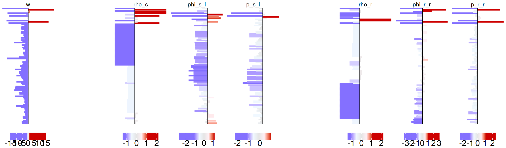
    


```R
IDs <- as.character(c(ID_order_rho_s_only_down
                         ,ID_order_phi_s_only_down
                         ,ID_order_p_s_only_down
                         ,ID_order_rho_r_only_down
                         ,ID_order_phi_r_only_down
                         ,ID_order_p_r_only_down
                     ))
IDs <- c(IDs_lim[!(IDs_lim %in% IDs)]
        ,IDs)

# revert
IDs <- IDs[length(IDs):1]

options(repr.plot.width = 17
       ,repr.plot.height = 5#3
       )

rownames(interactions$anno_interactions) <- interactions$anno_interactions$interaction_ID
my_anno_interactions <- interactions$anno_interactions[IDs,]
my_anno_interactions$interaction_ID <- factor(my_anno_interactions$interaction_ID
                                             ,ordered = TRUE
                                                    )

print(head(my_anno_interactions$interaction_ID))
print(head(my_anno_interactions$log2FC_weights))


plot_all_forests(my_idx = rep(TRUE,nrow(my_anno_interactions))
                 ,my_anno_interactions = my_anno_interactions
                 ,keep_order = TRUE
                 ,threshold = 1
                 ,legend_title_size = 0
                 ,legend_text_size = 20
                )
```

    [1] NK:ARF6_Gran:SMAP1  NK:IFNGR1_Mono:FCAR T:ARF6_Gran:SMAP1  
    [4] Gran:TLR2_Gran:CD14 B:MS4A1_DC:CD53     NK:S100A9_DC:ITGB2 
    95 Levels: B:LGALS1_DC:PTPRC < B:MS4A1_DC:CD53 < ... < T:SORL1_DC:APP
    [1] -3.608763 -3.796033 -2.951955 -1.197836 -2.961823 -3.218599


    

    


```R
IDs <- as.character(c(ID_order_rho_s_only_up
                          ,ID_order_phi_s_only_up
                          ,ID_order_p_s_only_up
                          ,ID_order_rho_r_only_up
                          ,ID_order_phi_r_only_up
                          ,ID_order_p_r_only_up
                     ))
IDs <- c(IDs_lim[!(IDs_lim %in% IDs)]
        ,IDs)

# revert
IDs <- IDs[length(IDs):1]

options(repr.plot.width = 17
       ,repr.plot.height = 1.5)

rownames(interactions$anno_interactions) <- interactions$anno_interactions$interaction_ID
my_anno_interactions <- interactions$anno_interactions[IDs,]
my_anno_interactions$interaction_ID <- factor(my_anno_interactions$interaction_ID
                                             ,ordered = TRUE
                                                    )

print(head(my_anno_interactions$interaction_ID))
print(head(my_anno_interactions$log2FC_weights))


plot_all_forests(my_idx = rep(TRUE,nrow(my_anno_interactions))
                 ,my_anno_interactions = my_anno_interactions
                 ,keep_order = TRUE
                 ,threshold = 1
                 ,legend_title_size = 0
                 ,legend_text_size = 20
                )
```

    [1] HSPC:MDK_Gran:SORL1  HSPC:MDK_Gran:NOTCH2 Ery:HSP90AA1_DC:LRP1
    [4] T:CD6_Mono:ALCAM     DC:CALR_HSPC:ITGA2B  T:MAML2_HSPC:NOTCH2 
    15 Levels: B:LGALS1_DC:PTPRC < B:TGFB1_DC:SMAD3 < ... < T:PIK3CA_Mono:IFNAR2
    [1]   2.356483   1.278511 -11.721997  11.908957 -12.846287   0.260611


    
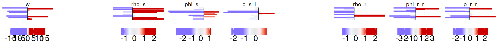
    


```R
IDs <- as.character(c(ID_order_concordantDown_s
                          ,ID_order_concordantDown_r
                          ,ID_order_concordantDown_b_one_one
                          ,ID_order_concordantDown_b_one_several
                          ,ID_order_concordantDown_b_several_one
                          ,ID_order_concordantDown_b_several_several
                     ))
IDs <- c(IDs_lim[!(IDs_lim %in% IDs)]
        ,IDs)

# revert
IDs <- IDs[length(IDs):1]

options(repr.plot.width = 17
       ,repr.plot.height = 3)

rownames(interactions$anno_interactions) <- interactions$anno_interactions$interaction_ID
my_anno_interactions <- interactions$anno_interactions[IDs,]
my_anno_interactions$interaction_ID <- factor(my_anno_interactions$interaction_ID
                                             ,ordered = TRUE
                                                    )

print(head(my_anno_interactions$interaction_ID))
print(head(my_anno_interactions$log2FC_weights))


plot_all_forests(my_idx = rep(TRUE,nrow(my_anno_interactions))
                 ,my_anno_interactions = my_anno_interactions
                 ,keep_order = TRUE
                 ,threshold = 1
                 ,legend_title_size = 0
                 ,legend_text_size = 20
                )
```

    [1] Gran:LILRB2_DC:HLA-F Gran:LILRB2_DC:CD33  DC:FCGRT_Gran:LILRB2
    [4] DC:LILRB2_DC:HLA-F   DC:FCGRT_DC:LILRB2   DC:LRPAP1_DC:LRP1   
    231 Levels: B:B2M_DC:CD1C < B:B2M_DC:HLA-F < ... < T:PSAP_DC:LRP1
    [1]  -2.755589  -1.618119  -2.408078  -2.651567  -2.695203 -14.462272


    
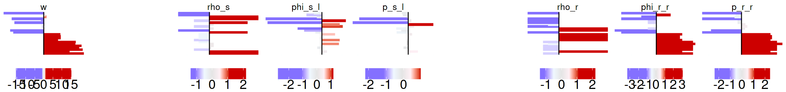
    


```R
IDs <- as.character(c(ID_order_concordantUp_s
                          ,ID_order_concordantUp_r
                          ,ID_order_concordantUp_b_one_one
                          ,ID_order_concordantUp_b_one_several
                          ,ID_order_concordantUp_b_several_one
                          ,ID_order_concordantUp_b_several_several
                     ))
IDs <- c(IDs_lim[!(IDs_lim %in% IDs)]
        ,IDs)

# revert
IDs <- IDs[length(IDs):1]

options(repr.plot.width = 17
       ,repr.plot.height = 2)

rownames(interactions$anno_interactions) <- interactions$anno_interactions$interaction_ID
my_anno_interactions <- interactions$anno_interactions[IDs,]
my_anno_interactions$interaction_ID <- factor(my_anno_interactions$interaction_ID
                                             ,ordered = TRUE
                                                    )

print(head(my_anno_interactions$interaction_ID))
print(head(my_anno_interactions$log2FC_weights))


plot_all_forests(my_idx = rep(TRUE,nrow(my_anno_interactions))
                 ,my_anno_interactions = my_anno_interactions
                 ,keep_order = TRUE
                 ,threshold = 1
                 ,legend_title_size = 0
                 ,legend_text_size = 20
                )
```

    [1] HSPC:B2M_B:TFRC     HSPC:ARF6_HSPC:PLD1 B:B2M_B:TFRC       
    [4] NK:B2M_B:TFRC       T:B2M_B:TFRC        T:CD6_Mono:ALCAM   
    22 Levels: B:ARF6_HSPC:PLD1 < B:B2M_B:TFRC < ... < T:PIK3CA_Mono:IFNAR2
    [1] 15.218187  9.687684 14.762272 13.423843 14.364316 11.908957


    
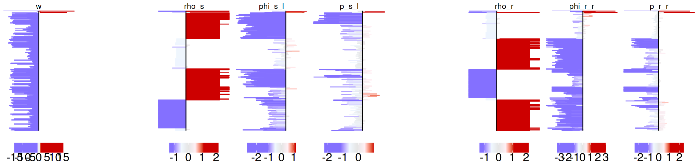
    


```R
IDs <- as.character(c(ID_order_insuffDown_s
                          ,ID_order_insuffDown_r
                          ,ID_order_insuffDown_b
                     ))
IDs <- c(IDs_lim[!(IDs_lim %in% IDs)]
        ,IDs)

# revert
IDs <- IDs[length(IDs):1]

options(repr.plot.width = 17
       ,repr.plot.height = 4)

rownames(interactions$anno_interactions) <- interactions$anno_interactions$interaction_ID
my_anno_interactions <- interactions$anno_interactions[IDs,]
my_anno_interactions$interaction_ID <- factor(my_anno_interactions$interaction_ID
                                             ,ordered = TRUE
                                                    )

print(head(my_anno_interactions$interaction_ID))
print(head(my_anno_interactions$log2FC_weights))


plot_all_forests(my_idx = rep(TRUE,nrow(my_anno_interactions))
                 ,my_anno_interactions = my_anno_interactions
                 ,keep_order = TRUE
                 ,threshold = 1
                 ,legend_title_size = 0
                 ,legend_text_size = 20
                )
```

    [1] Gran:PRLR_Ery:EMC1    Gran:S100A12_Ery:CD36 Gran:FPR1_Ery:ANXA1  
    [4] Gran:FPR1_HSPC:ANXA1  T:MAML2_Ery:NOTCH2    Gran:CD14_Ery:RIPK1  
    498 Levels: B:CALR_HSPC:ITGA2B < B:HLA-E_Ery:SLC16A4 < ... < T:PIK3CA_Mono:IFNAR2
    [1] -10.41183  -3.59651 -10.41359 -12.12921 -10.32085 -11.14688


    

    


```R
IDs <- as.character(c(ID_order_insuffUp_s
                          ,ID_order_insuffUp_r
                          ,ID_order_insuffUp_b
                     ))
IDs <- c(IDs_lim[!(IDs_lim %in% IDs)]
        ,IDs)

# revert
IDs <- IDs[length(IDs):1]

options(repr.plot.width = 17
       ,repr.plot.height = 1.5)

rownames(interactions$anno_interactions) <- interactions$anno_interactions$interaction_ID
my_anno_interactions <- interactions$anno_interactions[IDs,]
my_anno_interactions$interaction_ID <- factor(my_anno_interactions$interaction_ID
                                             ,ordered = TRUE
                                                    )

print(head(my_anno_interactions$interaction_ID))
print(head(my_anno_interactions$log2FC_weights))


plot_all_forests(my_idx = rep(TRUE,nrow(my_anno_interactions))
                 ,my_anno_interactions = my_anno_interactions
                 ,keep_order = TRUE
                 ,threshold = 1
                 ,legend_title_size = 0
                 ,legend_text_size = 20
                )
```

    [1] Gran:ADAM17_Ery:MUC1 Ery:HSP90AA1_DC:LRP1 T:CD6_Mono:ALCAM    
    [4] DC:CALR_HSPC:ITGA2B  T:MAML2_HSPC:NOTCH2  B:TGFB1_DC:SMAD3    
    14 Levels: B:LGALS1_DC:PTPRC < B:TGFB1_DC:SMAD3 < ... < T:PIK3CA_Mono:IFNAR2
    [1]   1.1352864 -11.7219973  11.9089569 -12.8462873   0.2606110  -0.5926325


    
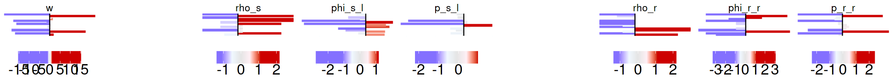
    


```R
length(ID_order_suffComp_b)
```


349


```R
IDs <- as.character(c(ID_order_suffComp_s
                          ,ID_order_suffComp_r
                          ,ID_order_suffComp_b
                     ))
IDs <- c(IDs_lim[!(IDs_lim %in% IDs)]
        ,IDs)

# revert
IDs <- IDs[length(IDs):1]

options(repr.plot.width = 17
       ,repr.plot.height = 5)

rownames(interactions$anno_interactions) <- interactions$anno_interactions$interaction_ID
my_anno_interactions <- interactions$anno_interactions[IDs,]
my_anno_interactions$interaction_ID <- factor(my_anno_interactions$interaction_ID
                                             ,ordered = TRUE
                                                    )

print(head(my_anno_interactions$interaction_ID))
print(head(my_anno_interactions$log2FC_weights))


plot_all_forests(my_idx = rep(TRUE,nrow(my_anno_interactions))
                 ,my_anno_interactions = my_anno_interactions
                 ,keep_order = TRUE
                 ,threshold = 1
                 ,legend_title_size = 0
                 ,legend_text_size = 20
                )
```

    [1] B:TGFB1_DC:SMAD3    B:TGFB1_DC:LPP      B:LGALS1_DC:PTPRC  
    [4] B:CD99_DC:PILRA     B:SYK_Ery:EPOR      T:MAML2_HSPC:NOTCH2
    778 Levels: B:ACTR2_Ery:LDLR < B:ADAM10_Ery:CD44 < ... < T:UBC_HSPC:SMAD3
    [1] -0.5926325 -0.9949870 -0.9877472 -0.7639546 -0.5570944  0.2606110


    
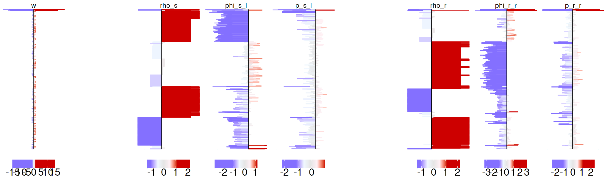
    


```R
idx_sign_lasry <- !is.na(interactions$anno_interactions$sign) & interactions$anno_interactions$sign
sum(idx_sign_lasry)
```


872


```R
# ligands and receptors in the immune interactions: down in Lasry
idx_down_Lasry_immune <- idx_sign_lasry & (
    interactions$anno_interactions$log2FC_weights < 0) & (
    !(grepl("Ery",interactions$anno_interactions$interaction_ID)
     ) & !(grepl("HSPC", interactions$anno_interactions$interaction_ID))
)
```


```R
ligrec_down_Lasry_immune <- unique(c(interactions$anno_interactions$ligand_gene_name[idx_down_Lasry_immune]
                                               ,interactions$anno_interactions$receptor_gene_name[idx_down_Lasry_immune]
                                              )
                                            )
```


```R
print(str(ligrec_down_Lasry_immune))
write.csv(ligrec_down_Lasry_immune
         ,file = paste0(path_in,"ligrec_downImmune_Lasry.csv")
         ,row.names=FALSE
         ,quote=FALSE)
```

     chr [1:143] "RETN" "PTGS2" "CD14" "FCAR" "GNAI2" "THBS1" "AGTRAP" "CD99" ...
    NULL


```R
# ligands and receptors: good quality in Lasry (background set)
idx_good <- interactions$anno_interactions$passed_QC_filter
ligrec_goodQuality_Lasry <- unique(c(interactions$anno_interactions$ligand_gene_name[idx_good]
                                               ,interactions$anno_interactions$receptor_gene_name[idx_good]
                                              )
                                            )

```


```R
print(str(ligrec_goodQuality_Lasry))
write.csv(ligrec_goodQuality_Lasry 
         ,file = paste0(path_in,"ligrec_goodQuality_Lasry.csv")
         ,row.names=FALSE
         ,quote=FALSE)
```

     chr [1:428] "AGTRAP" "ARF6" "B2M" "CALR" "CCL3" "CD1D" "CD99" "CIRBP" ...
    NULL


```R
# random 387 genes
ligrec_random <- ligrec_goodQuality_Lasry[sample.int(660, 387)]
print(length(unique(ligrec_random)))

```

    [1] 237


```R
write.csv(ligrec_random
         ,file = "ligrec_random_Lasry.csv"
         ,row.names=FALSE
         ,quote=FALSE)
```


```R
sessionInfo()
```


    R version 4.1.2 (2021-11-01)
    Platform: x86_64-pc-linux-gnu (64-bit)
    Running under: Ubuntu 22.04.2 LTS
    
    Matrix products: default
    BLAS:   /usr/lib/x86_64-linux-gnu/openblas-pthread/libblas.so.3
    LAPACK: /usr/lib/x86_64-linux-gnu/openblas-pthread/libopenblasp-r0.3.20.so
    
    locale:
     [1] LC_CTYPE=en_US.UTF-8       LC_NUMERIC=C              
     [3] LC_TIME=de_DE.UTF-8        LC_COLLATE=en_US.UTF-8    
     [5] LC_MONETARY=de_DE.UTF-8    LC_MESSAGES=en_US.UTF-8   
     [7] LC_PAPER=de_DE.UTF-8       LC_NAME=C                 
     [9] LC_ADDRESS=C               LC_TELEPHONE=C            
    [11] LC_MEASUREMENT=de_DE.UTF-8 LC_IDENTIFICATION=C       
    
    attached base packages:
    [1] grid      stats     graphics  grDevices utils     datasets  methods  
    [8] base     
    
    other attached packages:
    [1] gridExtra_2.3         igraph_1.4.2          circlize_0.4.15      
    [4] ComplexHeatmap_2.10.0 ggrepel_0.9.2         ggplot2_3.4.2        
    [7] community_1.3.8      
    
    loaded via a namespace (and not attached):
     [1] pbdZMQ_0.3-7        shape_1.4.6         GetoptLong_1.0.5   
     [4] tidyselect_1.2.0    repr_1.1.4          colorspace_2.1-0   
     [7] vctrs_0.6.3         generics_0.1.3      stats4_4.1.2       
    [10] htmltools_0.5.4     base64enc_0.1-3     utf8_1.2.3         
    [13] rlang_1.1.1         pillar_1.9.0        glue_1.6.2         
    [16] withr_2.5.0         DBI_1.1.3           RColorBrewer_1.1-3 
    [19] BiocGenerics_0.40.0 uuid_1.1-0          matrixStats_0.63.0 
    [22] foreach_1.5.2       lifecycle_1.0.3     munsell_0.5.0      
    [25] gtable_0.3.3        GlobalOptions_0.1.2 codetools_0.2-18   
    [28] evaluate_0.19       labeling_0.4.2      IRanges_2.28.0     
    [31] fastmap_1.1.0       Cairo_1.6-0         doParallel_1.0.17  
    [34] parallel_4.1.2      fansi_1.0.4         IRdisplay_1.1      
    [37] Rcpp_1.0.9          scales_1.2.1        IRkernel_1.3       
    [40] S4Vectors_0.32.4    magick_2.7.3        jsonlite_1.8.4     
    [43] farver_2.1.1        rjson_0.2.21        png_0.1-8          
    [46] digest_0.6.31       dplyr_1.0.10        clue_0.3-64        
    [49] cli_3.6.1           tools_4.1.2         magrittr_2.0.3     
    [52] tibble_3.2.1        cluster_2.1.4       crayon_1.5.2       
    [55] pkgconfig_2.0.3     MASS_7.3-58.1       assertthat_0.2.1   
    [58] iterators_1.0.14    R6_2.5.1            compiler_4.1.2     


```R

```


```R

```
